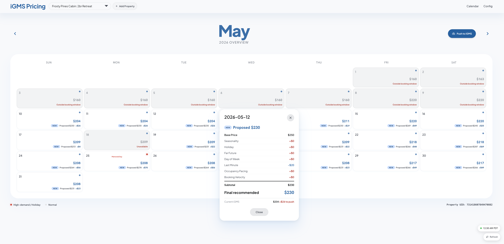

# iGMS Dynamic Pricing Engine

Dynamic pricing engine for short-term rental properties managed via iGMS.



## Architecture

```
airbnb-dynamic-pricing/
├── src/pricing_engine/       # Core pricing engine
│   ├── engine.py             # Weighted strategy runner
│   ├── config.py             # Pydantic env config
│   ├── client.py             # iGMS API client
│   ├── config_store.py       # Per-property JSON config store
│   ├── cli.py                # CLI entry point
│   ├── scheduler.py          # Interval-based pricing scheduler
│   └── strategies/
│       ├── base.py            # Abstract strategy
│       ├── demand.py          # Demand-based pricing
│       ├── event.py           # Event/seasonal pricing
│       ├── competitor.py      # Competitor-adjusted pricing
│       ├── yield_.py          # Yield/opportunity-cost pricing
│       └── availability.py    # Availability rules
├── dashboard/                # FastAPI web dashboard
│   ├── main.py               # App entry point
│   ├── engine_proxy.py       # Bridge between dashboard and engine
│   ├── routes/               # API endpoints
│   ├── templates/            # Jinja2 HTML templates
│   └── static/               # CSS/JS assets
├── config/properties/        # Per-property JSON configs
├── tests/                    # Unit + integration tests
├── .env.example              # Template for .env
└── pyproject.toml            # Root package definition
```

## Setup

### 1. Configure credentials

```bash
cp .env.example .env
```

Edit `.env` and fill in your iGMS OAuth credentials and access token.

### 2. Install dependencies

```bash
pip install -e .
```

### 3. Add property configs

Property configs live in `config/properties/`. Each file is named `{property_uid}.json`.

Example (`config/properties/731418607849470882.json`):

```json
{
  "property_uid": "731418607849470882",
  "name": "Frosty Pines",
  "state": "CA",
  "base_price": 200.0,
  "min_price": 75.0,
  "max_price": 1500.0,
  "quality_score": 0.85,
  "strategy_weights": {
    "demand": 0.40,
    "event": 0.30,
    "competitor": 0.20,
    "yield": 0.10
  }
}
```

## CLI Usage

```bash
# Check current vs recommended prices
igms-pricing status

# Compute prices without writing (preview)
igms-pricing dry-run

# Push prices to iGMS
igms-pricing push

# Run scheduler (continuous pricing loop)
igms-pricing schedule
```

## Runbook A: Weekly AI/CLI Automation

Use this path when an AI agent, cron job, or server process should run pricing pushes automatically every week.

### Where config is stored

- Per-property config files: `config/properties/{property_uid}.json`
- Example:
  - `config/properties/731418607849470882.json`
  - `config/properties/850410072530215128.json`

### One-time setup

```bash
cp .env.example .env
pip install -e .
```

Fill `.env` with valid iGMS credentials/tokens before scheduling.

### Weekly command

```bash
igms-pricing push
```

### Example cron (every Monday at 07:00)

```cron
0 7 * * 1 cd /absolute/path/to/airbnb-dynamic-pricing && /usr/bin/env bash -lc 'source .venv/bin/activate && igms-pricing push >> logs/weekly-pricing.log 2>&1'
```

Notes:
- Make sure the environment running cron can read `.env`.
- Ensure all target property JSON files already exist in `config/properties/`.

## Runbook B: User Web App Config Editing

Use this path when a human operator wants to adjust pricing knobs in the UI.

### Where config is stored

- The web editor reads/writes the same per-property JSON files in:
  - `config/properties/{property_uid}.json`

### Start the dashboard

```bash
cd dashboard
python3 -m venv venv
source venv/bin/activate
pip install fastapi "starlette>=0.46.0,<1.0.0" uvicorn jinja2 holidays
uvicorn main:app --reload --port 5005
```

Open [http://localhost:5005/calendar](http://localhost:5005/calendar).

### Edit flow

1. Open a property in the calendar/config UI.
2. Change seasonality, temporal pricing, occupancy pacing, booking velocity, or other fields.
3. Click **Save Config**.
4. Use **Push to iGMS** from calendar view to send updated recommendations.

## Dashboard

A FastAPI web dashboard for visualizing and managing pricing.

```bash
cd dashboard
python3 -m venv venv
source venv/bin/activate
pip install fastapi "starlette>=0.46.0,<1.0.0" uvicorn jinja2 holidays
uvicorn main:app --reload --port 5005
```

Open **http://localhost:5005/calendar**.

The dashboard shows a monthly calendar grid with recommended vs. current prices, day-level factor breakdowns, availability status, and a config editor.

## Configuration Reference

| Variable | Default | Description |
|---|---|---|
| `IGMS_ACCESS_TOKEN` | — | iGMS access token (required) |
| `IGMS_CLIENT_ID` | — | OAuth client ID |
| `IGMS_CLIENT_SECRET` | — | OAuth client secret |
| `IGMS_REDIRECT_URI` | `http://localhost:8080/callback` | OAuth redirect URI |
| `IGMS_SCOPE` | `listings,calendar-control,pricing-management` | OAuth scopes |
| `PRICING_WINDOW_DAYS` | `90` | Days ahead to price |
| `SCHEDULE_INTERVAL_MINUTES` | `60` | Scheduler loop interval |
| `DEFAULT_BASE_PRICE` | `100.0` | Fallback base price (USD) |
| `DEFAULT_MIN_PRICE` | `50.0` | Floor price |
| `DEFAULT_MAX_PRICE` | `2000.0` | Ceiling price |
| `STRATEGY_WEIGHTS` | `demand:0.40,event:0.30,competitor:0.20,yield:0.10` | Default strategy weights |
| `LOG_LEVEL` | `INFO` | Logging level |

## iGMS API

- Base URL: `https://www.igms.com`
- Auth: `access_token` as query parameter
- Calendar read: `GET /api/v1/get-calendar-data`
- Bookings read: `GET /api/v1/get-bookings`
- Price write: `PUT /api/v1/update-calendar-data` (requires `pricing-management` scope)

## Testing

```bash
# Unit tests
python -m pytest tests/ -v

# Integration test (requires live token)
IGMS_ACCESS_TOKEN=your_token python -m pytest tests/test_integration.py -v
```
